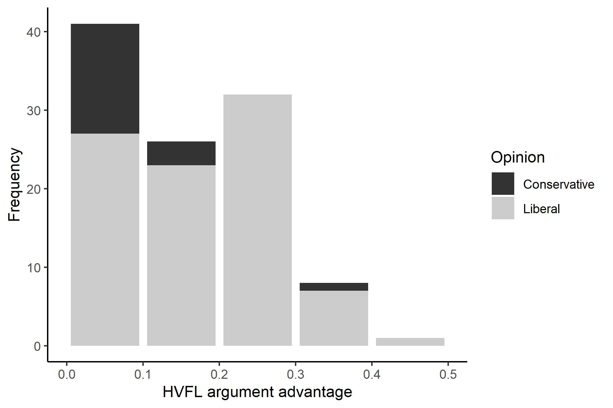
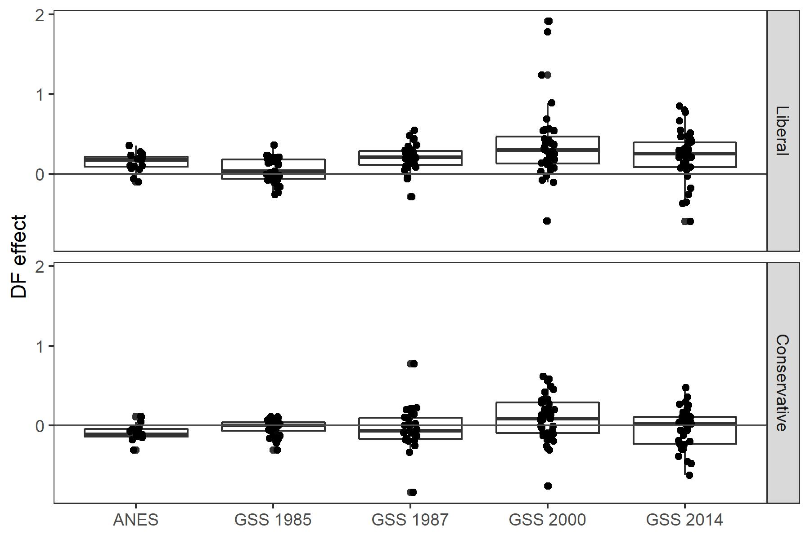

## N for abstract


```
## # A tibble: 1 x 2
##   n_issues n_resp
##      <int>  <int>
## 1       81   4395
```

```
## # A tibble: 1 x 2
##   n_issues n_resp
##      <int>  <int>
## 1       27  17611
```


# Methods


```
## # A tibble: 1 x 1
##   `n_distinct(id)`
##              <int>
## 1            17611
```

```
## # A tibble: 3 x 3
##   polviews         n  prop
##   <fct>        <int> <dbl>
## 1 Conservative  7317 0.399
## 2 Moderate      6062 0.330
## 3 Liberal       4977 0.271
```

```
## # A tibble: 1 x 4
##   `sum(n)` `mean(n)` `min(n)` `max(n)`
##      <int>     <dbl>    <int>    <int>
## 1   273554    10132.     1806    18633
```

```
## # A tibble: 1 x 1
##   `n_distinct(id)`
##              <int>
## 1             2264
```

```
## # A tibble: 3 x 3
##   polviews         n  prop
##   <fct>        <int> <dbl>
## 1 Conservative  1168 0.336
## 2 Moderate      1328 0.382
## 3 Liberal        979 0.282
```

```
## # A tibble: 1 x 4
##   `sum(n)` `mean(n)` `min(n)` `max(n)`
##      <int>     <dbl>    <int>    <int>
## 1   174983     2160.      374     4164
```


```
## # A tibble: 1 x 4
##       n `mean(age)` `sd(age)` `mean(sex == "Female")`
##   <int>       <dbl>     <dbl>                   <dbl>
## 1   215        42.3      11.2                   0.521
```

```
## # A tibble: 1 x 1
##   `mean(n) * 9`
##           <dbl>
## 1          12.3
```

```
## # A tibble: 1 x 1
##   `mean(n)`
##       <dbl>
## 1        98
```


```
## # A tibble: 1 x 6
##   `min(hvfl)` `max(hvfl)` `mean(hvfl)` `sd(hvfl)` `min(hvfl_se)` `max(hvfl_se)`
##         <dbl>       <dbl>        <dbl>      <dbl>          <dbl>          <dbl>
## 1      -0.245       0.289      0.00836      0.164         0.0191         0.0367
```

# Results




## DF effect estimated separately in each issue




## Multilevel models


### Supplementary Table S1. Items for moral opinions in the ANES, with their HVFL argument advantage.


|ANES item                                                                                                                                                                                                                                                                                                                                                                                                                              |  HVFL|
|:--------------------------------------------------------------------------------------------------------------------------------------------------------------------------------------------------------------------------------------------------------------------------------------------------------------------------------------------------------------------------------------------------------------------------------------|-----:|
|Do you think gay or lesbian couples, in other words, homosexual couples, should be legally permitted to adopt children?                                                                                                                                                                                                                                                                                                                |  0.29|
|Do you favor laws to protect homosexuals (gays and lesbians) against job discrimination?                                                                                                                                                                                                                                                                                                                                               |  0.28|
|Do you think homosexuals should be allowed to serve in the United States Armed Forces?                                                                                                                                                                                                                                                                                                                                                 |  0.26|
|We should be more tolerant of people who choose to live according to their own moral standards, even if they are very different from our own.                                                                                                                                                                                                                                                                                          |  0.25|
|This country would have many fewer problems if there were more emphasis on traditional family ties.                                                                                                                                                                                                                                                                                                                                    | -0.24|
|Do you favor the U.S. government torturing people, who are suspected of being terrorists, to try to get information?                                                                                                                                                                                                                                                                                                                   | -0.23|
|Recently there has been a lot of talk about women's rights. Some people feel that women should have an equal role with men in running business, industry and government. Others feel that a woman's place is in the home. What about you: should women have an equal role in running business, industry and government?                                                                                                                |  0.21|
|Do you think that maintaining order in the nation is more important than giving people more say in important government decisions?                                                                                                                                                                                                                                                                                                     | -0.21|
|Some say that the civil rights people have been trying to push too fast. Others feel they haven't pushed fast enough. How about you: Do you think that civil rights leaders are trying to push too fast?                                                                                                                                                                                                                               | -0.17|
|Do you favor the death penalty for persons convicted of murder?                                                                                                                                                                                                                                                                                                                                                                        | -0.17|
|Some people have suggested placing new limits on foreign imports in order to protect American jobs. Others say that such limits would raise consumer prices and hurt American exports. What about you, do you favor placing new limits on imports?                                                                                                                                                                                     | -0.16|
|Do you think the number of immigrants from foreign countries who are permitted to come to the United States to live should be increased?                                                                                                                                                                                                                                                                                               |  0.16|
|This country would be better off if we just stayed home and did not concern ourselves with problems in other parts of the world.                                                                                                                                                                                                                                                                                                       | -0.16|
|There has been some discussion about abortion during recent years. Do you think that the law should permit abortion in case of rape, incest, or when the woman's life is in danger?                                                                                                                                                                                                                                                    |  0.12|
|Some people feel that if black people are not getting fair treatment in jobs, the government in Washington ought to see to it that they do. Others feel that this is not the federal government's business. Should the government in Washington see to it that black people get fair treatment in jobs?                                                                                                                                |  0.10|
|Do you think the United States should be willing to use military force to solve international problems in the future?                                                                                                                                                                                                                                                                                                                  | -0.10|
|Some people are afraid the government in Washington is getting too powerful for the good of the country and the individual person. Others feel that the government in Washington is not getting too strong. What is your feeling? Do you think the government is too powerful?                                                                                                                                                         |  0.10|
|Recently, some big American companies have been hiring workers in foreign countries to replace workers in the U.S. Do you think the federal government should discourage companies from doing this?                                                                                                                                                                                                                                    | -0.10|
|Because of past discrimination blacks should be given preference in hiring and promotion.                                                                                                                                                                                                                                                                                                                                              | -0.07|
|Some people feel that the government in Washington should make every effort to improve the social and economic position of blacks. Others feel that the government should not make any special effort to help blacks because they should help themselves. What is your opinion: should the government in Washington make every effort to improve the social and economic position of blacks, rather than letting them help themselves? |  0.07|
|Some people say that the government in Washington should see to it that white and black children go to the same schools. Others claim this is not the government's business. What about you: should the government see to it that white and black children go to the same schools?                                                                                                                                                     |  0.06|
|There has been some discussion about abortion during recent years. Do you think that by law, a woman should always be able to obtain an abortion as a matter of personal choice?                                                                                                                                                                                                                                                       |  0.05|
|Irish, Italians, Jewish and many other minorities overcame prejudice and worked their way up. Blacks should do the same without any special favors.                                                                                                                                                                                                                                                                                    | -0.04|
|Do you think the federal government should make it more difficult for people to buy a gun than it is now?                                                                                                                                                                                                                                                                                                                              | -0.04|
|If a person doesn't care how an election comes out they shouldn't vote in it.                                                                                                                                                                                                                                                                                                                                                          | -0.03|
|By law, prayer should not be allowed in public schools.                                                                                                                                                                                                                                                                                                                                                                                | -0.02|
|There has been some discussion about abortion during recent years. Do you think that the law should permit abortion after the need for the abortion has been clearly established?                                                                                                                                                                                                                                                      |  0.02|

### Supplementary Table S2. Items for moral opinions in the GSS, with their HVFL argument advantage.

<table class=" lightable-classic" style='font-family: "Arial Narrow", "Source Sans Pro", sans-serif; margin-left: auto; margin-right: auto;'>
 <thead>
  <tr>
   <th style="text-align:left;"> GSS item </th>
   <th style="text-align:right;"> HVFL </th>
  </tr>
 </thead>
<tbody>
  <tr>
   <td style="text-align:left;"> Homosexual couples should have the right to marry one another. </td>
   <td style="text-align:right;"> 0.41 </td>
  </tr>
  <tr>
   <td style="text-align:left;"> Women should take care of running their homes and leave running the country up to men. </td>
   <td style="text-align:right;"> -0.37 </td>
  </tr>
  <tr>
   <td style="text-align:left;"> Do you think there should be laws against marriages between African-Americans and whites? </td>
   <td style="text-align:right;"> -0.37 </td>
  </tr>
  <tr>
   <td style="text-align:left;"> Would you be in favor of having a close relative or family member marry a black person? </td>
   <td style="text-align:right;"> 0.36 </td>
  </tr>
  <tr>
   <td style="text-align:left;"> Consider a man who admits that he is a homosexual. Should such a person be allowed to teach in a college or university? </td>
   <td style="text-align:right;"> 0.35 </td>
  </tr>
  <tr>
   <td style="text-align:left;"> Would you approve of a man punching a stranger who was in a protest march showing opposition to the other man's views? </td>
   <td style="text-align:right;"> -0.35 </td>
  </tr>
  <tr>
   <td style="text-align:left;"> Consider a man who admits that he is a homosexual. If some people in your community suggested that a book he wrote in favor of homosexuality should be taken out of your public library -- would you favor removing this book? </td>
   <td style="text-align:right;"> -0.33 </td>
  </tr>
  <tr>
   <td style="text-align:left;"> Would you be in favor of having a close relative or family member marry an Asian American person? </td>
   <td style="text-align:right;"> 0.32 </td>
  </tr>
  <tr>
   <td style="text-align:left;"> It is much better for everyone involved if the man is the achiever outside the home and the woman takes care of the home and family. </td>
   <td style="text-align:right;"> -0.32 </td>
  </tr>
  <tr>
   <td style="text-align:left;"> Consider a man who admits he is a Communist. Suppose he is teaching in a college. Should he be fired? </td>
   <td style="text-align:right;"> -0.30 </td>
  </tr>
  <tr>
   <td style="text-align:left;"> Would you approve of a policeman striking a citizen who had said vulgar and obscene things to the policeman? </td>
   <td style="text-align:right;"> -0.30 </td>
  </tr>
  <tr>
   <td style="text-align:left;"> Would you approve of a policeman striking a citizen who was being questioned as a suspect in a murder case? </td>
   <td style="text-align:right;"> -0.29 </td>
  </tr>
  <tr>
   <td style="text-align:left;"> Would you be in favor of having a close relative or family member marry a Hispanic American person? </td>
   <td style="text-align:right;"> 0.29 </td>
  </tr>
  <tr>
   <td style="text-align:left;"> What about sexual relations between two adults of the same sex--do you think it is always wrong? </td>
   <td style="text-align:right;"> -0.29 </td>
  </tr>
  <tr>
   <td style="text-align:left;"> Consider a man who admits that he is a homosexual? Suppose this admitted homosexual wanted to make a speech in your community. Should he be allowed to speak? </td>
   <td style="text-align:right;"> 0.29 </td>
  </tr>
  <tr>
   <td style="text-align:left;"> Do you agree that methods of birth control should be available to teenagers between the ages of 14 and 16 if their parents do not approve? </td>
   <td style="text-align:right;"> 0.28 </td>
  </tr>
  <tr>
   <td style="text-align:left;"> It is more important for a wife to help her husband's career than to have one herself. </td>
   <td style="text-align:right;"> -0.28 </td>
  </tr>
  <tr>
   <td style="text-align:left;"> Do you approve of a married woman earning money in business or industry if she has a husband capable of supporting her? </td>
   <td style="text-align:right;"> 0.27 </td>
  </tr>
  <tr>
   <td style="text-align:left;"> White people have a right to keep African-Americans out of their neighborhoods if they want to and African-Americans should respect that right. </td>
   <td style="text-align:right;"> -0.27 </td>
  </tr>
  <tr>
   <td style="text-align:left;"> African-Americans shouldn't push themselves where they're not wanted. </td>
   <td style="text-align:right;"> -0.26 </td>
  </tr>
  <tr>
   <td style="text-align:left;"> Consider a man who admits he is a Communist.  Suppose he wrote a book which is in your public library. Somebody in your community suggests that the book should be removed from the library. Would you favor removing it? </td>
   <td style="text-align:right;"> -0.26 </td>
  </tr>
  <tr>
   <td style="text-align:left;"> Do you agree that it is sometimes necessary to discipline a child with a good hard spanking? </td>
   <td style="text-align:right;"> -0.25 </td>
  </tr>
  <tr>
   <td style="text-align:left;"> If you and your friends belonged to a social club that would not let African-Americans join -- would you try to change the rules so that African-Americans could join? </td>
   <td style="text-align:right;"> 0.25 </td>
  </tr>
  <tr>
   <td style="text-align:left;"> There's been a lot of discussion about the way morals and attitudes about sex are changing in this country. If a man and woman have sex relations before marriage -- do you think it is wrong? </td>
   <td style="text-align:right;"> -0.24 </td>
  </tr>
  <tr>
   <td style="text-align:left;"> In general some people think that it is the responsibility of the government in Washington to see to it that people have help in paying for doctors and hospital bills. Others think that these matters are not the responsibility of the federal government and that people should take care of these things themselves. Do you think that it is the responsibility of the government? </td>
   <td style="text-align:right;"> 0.24 </td>
  </tr>
  <tr>
   <td style="text-align:left;"> There are always some people whose ideas are considered bad or dangerous by other people. For instance: somebody who is against all churches and religion -- should such a person be allowed to teach in a college or university? </td>
   <td style="text-align:right;"> 0.24 </td>
  </tr>
  <tr>
   <td style="text-align:left;"> Consider a person who advocates doing away with elections and letting the military run the country. Suppose he wrote a book advocating doing away with elections and letting the military run the country. Somebody in your community suggests that the book be removed from the public library. Would you favor removing it? </td>
   <td style="text-align:right;"> -0.23 </td>
  </tr>
  <tr>
   <td style="text-align:left;"> Do you think the use of marijuana should be made legal? </td>
   <td style="text-align:right;"> 0.23 </td>
  </tr>
  <tr>
   <td style="text-align:left;"> Consider a man who admits he is a Communist. Suppose this admitted Communist wanted to make a speech in your community. Should he be allowed to speak? </td>
   <td style="text-align:right;"> 0.23 </td>
  </tr>
  <tr>
   <td style="text-align:left;"> There are always some people whose ideas are considered bad or dangerous by other people. For instance somebody who is against all churches and religion. If some people in your community suggested that a book he wrote against churches and religion should be taken out of your public library -- would you favor removing this book? </td>
   <td style="text-align:right;"> -0.23 </td>
  </tr>
  <tr>
   <td style="text-align:left;"> Would you approve of a policeman striking a citizen who was attempting to escape from custody? </td>
   <td style="text-align:right;"> -0.23 </td>
  </tr>
  <tr>
   <td style="text-align:left;"> Would you be in favor of having a close relative or family member marry a white person? </td>
   <td style="text-align:right;"> 0.21 </td>
  </tr>
  <tr>
   <td style="text-align:left;"> Consider somebody who is against all churches and religion. If such a person wanted to make a speech in your (city/town/community) against churches and religion -- should he be allowed to speak? </td>
   <td style="text-align:right;"> 0.21 </td>
  </tr>
  <tr>
   <td style="text-align:left;"> Some people think that the government in Washington should do everything possible to improve the standard of living of all poor Americans. Other people think it is not the government's responsibility and that each person should take care of himself. Do you think that the government should do everything possible to improve the standard of living of all poor Americans? </td>
   <td style="text-align:right;"> 0.18 </td>
  </tr>
  <tr>
   <td style="text-align:left;"> When a person has a disease that cannot be cured -- do you think doctors should be allowed by law to end the patient's life by some painless means if the patient and his family request it? </td>
   <td style="text-align:right;"> 0.17 </td>
  </tr>
  <tr>
   <td style="text-align:left;"> Consider a person who advocates doing away with elections and letting the military run the country. If such a person wanted to make a speech in your community -- should he be allowed to speak? </td>
   <td style="text-align:right;"> 0.17 </td>
  </tr>
  <tr>
   <td style="text-align:left;"> Consider people who are in their early teens -- say 14 to 16 years old. In that case: do you think sex relations before marriage are wrong? </td>
   <td style="text-align:right;"> -0.17 </td>
  </tr>
  <tr>
   <td style="text-align:left;"> Consider your feelings about pornography laws. Do you think it should be illegal? </td>
   <td style="text-align:right;"> -0.16 </td>
  </tr>
  <tr>
   <td style="text-align:left;"> Would you approve of a man punching a stranger who was drunk and bumped into the man and his wife on the street? </td>
   <td style="text-align:right;"> -0.16 </td>
  </tr>
  <tr>
   <td style="text-align:left;"> Consider a person who advocates doing away with elections and letting the military run the country. Should such a person be allowed to teach in a college or university? </td>
   <td style="text-align:right;"> 0.16 </td>
  </tr>
  <tr>
   <td style="text-align:left;"> Do you think it should be possible for a pregnant woman to obtain a legal abortion if the woman's own health is seriously endangered by the pregnancy? </td>
   <td style="text-align:right;"> 0.16 </td>
  </tr>
  <tr>
   <td style="text-align:left;"> Now consider a Muslim clergyman who preaches hatred of the United States. If such a person wanted to make a speech in your community preaching hatred of the United States - should he be allowed to speak? </td>
   <td style="text-align:right;"> 0.15 </td>
  </tr>
  <tr>
   <td style="text-align:left;"> Do you think it should be possible for a pregnant woman to obtain a legal abortion if she became pregnant as a result of rape? </td>
   <td style="text-align:right;"> 0.14 </td>
  </tr>
  <tr>
   <td style="text-align:left;"> Do you favor the death penalty for persons convicted of murder? </td>
   <td style="text-align:right;"> -0.14 </td>
  </tr>
  <tr>
   <td style="text-align:left;"> Now consider a Muslim clergyman who preaches hatred of the United States. Should such a person be allowed to teach in a college or university? </td>
   <td style="text-align:right;"> 0.14 </td>
  </tr>
  <tr>
   <td style="text-align:left;"> Some people think that African-Americans have been discriminated against for so long that the government has a special obligation to help improve their living standards. Others believe that the government should not be giving special treatment to African-Americans. Do you think that the government should help improve the living standards of African-Americans? </td>
   <td style="text-align:right;"> 0.13 </td>
  </tr>
  <tr>
   <td style="text-align:left;"> Are there any situations you can imagine in which you would approve of a policeman striking an adult male citizen? </td>
   <td style="text-align:right;"> -0.12 </td>
  </tr>
  <tr>
   <td style="text-align:left;"> Suppose there is a community-wide vote on the general housing issue. There are two possible laws to vote on (OWNER DECIDES and CAN'T DISCRIMINATE). Would you vote for owner decides? </td>
   <td style="text-align:right;"> -0.11 </td>
  </tr>
  <tr>
   <td style="text-align:left;"> Do you think a person has the right to end his or her own life if this person has an incurable disease? </td>
   <td style="text-align:right;"> 0.11 </td>
  </tr>
  <tr>
   <td style="text-align:left;"> Would you be for sex education in the public schools? </td>
   <td style="text-align:right;"> 0.11 </td>
  </tr>
  <tr>
   <td style="text-align:left;"> Everything considered: would you say that -- in general -- you approve of wiretapping? </td>
   <td style="text-align:right;"> -0.11 </td>
  </tr>
  <tr>
   <td style="text-align:left;"> Would you approve of a man punching a stranger who was beating up a woman and the man saw it? </td>
   <td style="text-align:right;"> 0.11 </td>
  </tr>
  <tr>
   <td style="text-align:left;"> In general - would you say that people should obey the law without exception rather than there are exceptional occasions on which people should follow their consciences even if it means breaking the law? </td>
   <td style="text-align:right;"> -0.10 </td>
  </tr>
  <tr>
   <td style="text-align:left;"> Do you think a person has the right to end his or her own life if this person is tired of living and ready to die? </td>
   <td style="text-align:right;"> 0.10 </td>
  </tr>
  <tr>
   <td style="text-align:left;"> Do you think it should be possible for a pregnant woman to obtain a legal abortion if she is not married and does not want to marry the man? </td>
   <td style="text-align:right;"> 0.08 </td>
  </tr>
  <tr>
   <td style="text-align:left;"> Government should let ordinary people decide for themselves how to protect the environment - even if it means they don't always dothe right thing - rather than passing laws to make ordinary people protect the environment as it interferes with people's right to make their own decisions. </td>
   <td style="text-align:right;"> 0.08 </td>
  </tr>
  <tr>
   <td style="text-align:left;"> Would you yourself have any objection to sending your children to a school where a few of the children are African-Americans? </td>
   <td style="text-align:right;"> -0.07 </td>
  </tr>
  <tr>
   <td style="text-align:left;"> What is your opinion about a married person having sexual relations with someone other than the marriage partner--is it wrong? </td>
   <td style="text-align:right;"> -0.07 </td>
  </tr>
  <tr>
   <td style="text-align:left;"> Even if it brings no immediate benefits - scientific research that advances the frontiers of knowledge is necessary and should be supported by the federal government. </td>
   <td style="text-align:right;"> 0.07 </td>
  </tr>
  <tr>
   <td style="text-align:left;"> Would you approve of a policeman striking a citizen who was attacking the policeman with his fists? </td>
   <td style="text-align:right;"> -0.06 </td>
  </tr>
  <tr>
   <td style="text-align:left;"> Do you think it should be possible for a pregnant woman to obtain a legal abortion if the family has a very low income and cannot afford any more children? </td>
   <td style="text-align:right;"> 0.06 </td>
  </tr>
  <tr>
   <td style="text-align:left;"> Would you favor a law which would require a person to obtain a police permit before he or she could buy a gun? </td>
   <td style="text-align:right;"> -0.05 </td>
  </tr>
  <tr>
   <td style="text-align:left;"> Consider a person who believes that Blacks are genetically inferior. If some people in your community suggested that a book he wrote which said Blacks are inferior should be taken out of your public library -- would you favor removing this book? </td>
   <td style="text-align:right;"> -0.05 </td>
  </tr>
  <tr>
   <td style="text-align:left;"> In general: do you favor the busing of African-American and white school children from one school district to another? </td>
   <td style="text-align:right;"> 0.05 </td>
  </tr>
  <tr>
   <td style="text-align:left;"> Are there any situations that you can imagine in which you would approve of a man punching an adult male stranger? </td>
   <td style="text-align:right;"> -0.05 </td>
  </tr>
  <tr>
   <td style="text-align:left;"> Do you think it should be possible for a pregnant woman to obtain a legal abortion if she is married and does not want any more children? </td>
   <td style="text-align:right;"> 0.05 </td>
  </tr>
  <tr>
   <td style="text-align:left;"> Consider a person who believes that Blacks are genetically inferior. Should such a person be allowed to teach in a college or university? </td>
   <td style="text-align:right;"> 0.05 </td>
  </tr>
  <tr>
   <td style="text-align:left;"> Would you yourself have any objection to sending your children to a school where more than half of the children are African-Americans? </td>
   <td style="text-align:right;"> -0.05 </td>
  </tr>
  <tr>
   <td style="text-align:left;"> Would you approve of a man punching a stranger who had broken into the man's house? </td>
   <td style="text-align:right;"> -0.04 </td>
  </tr>
  <tr>
   <td style="text-align:left;"> Do you think a person has the right to end his or her own life if this person has dishonored his or her family? </td>
   <td style="text-align:right;"> -0.04 </td>
  </tr>
  <tr>
   <td style="text-align:left;"> Some people say that because of past discrimination - blacks should be given preference in hiring and promotion. Others say that such preference in hiring and promotion of blacks is wrong because it discriminates against whites. What about your opinion - are you for preferential hiring and promotion of blacks? </td>
   <td style="text-align:right;"> -0.04 </td>
  </tr>
  <tr>
   <td style="text-align:left;"> Do you think it should be possible for a pregnant woman to obtain a legal abortion if there is a strong chance of serious defect in the baby? </td>
   <td style="text-align:right;"> 0.03 </td>
  </tr>
  <tr>
   <td style="text-align:left;"> Irish and Italians and Jewish and many other minorities overcame prejudice and worked their way up. Blacks should do the same without special favors. </td>
   <td style="text-align:right;"> -0.02 </td>
  </tr>
  <tr>
   <td style="text-align:left;"> Would you approve of a man punching a stranger who had hit the man's child after the child accidentally damaged the stranger's car? </td>
   <td style="text-align:right;"> -0.02 </td>
  </tr>
  <tr>
   <td style="text-align:left;"> Government should let businesses decide for themselves how to protect the environment - even if it means they don't always do the right thing - rather than passing laws to make businesses protect the environment as it interferes with business' right to make their own decisions. </td>
   <td style="text-align:right;"> 0.02 </td>
  </tr>
  <tr>
   <td style="text-align:left;"> Would you yourself have any objection to sending your children to a school where half of the children are African-Americans? </td>
   <td style="text-align:right;"> -0.02 </td>
  </tr>
  <tr>
   <td style="text-align:left;"> Consider a person who believes that Blacks are genetically inferior. If such a person wanted to make a speech in your community claiming that Blacks are inferior -- should he be allowed to speak? </td>
   <td style="text-align:right;"> 0.01 </td>
  </tr>
  <tr>
   <td style="text-align:left;"> Some people say that because of past discrimination women should be given preference in hiring and promotion. Others say that such preference in hiring and promotion of women is wrong because it discriminates against men. What about your opinion - are you for preferential hiring and promotion of women? </td>
   <td style="text-align:right;"> -0.01 </td>
  </tr>
  <tr>
   <td style="text-align:left;"> Because of past discrimination employers should make special efforts to hire and promote qualified women. </td>
   <td style="text-align:right;"> -0.01 </td>
  </tr>
  <tr>
   <td style="text-align:left;"> Do you think it should be possible for a pregnant woman to obtain a legal abortion if the woman wants it for any reason? </td>
   <td style="text-align:right;"> 0.00 </td>
  </tr>
  <tr>
   <td style="text-align:left;"> Do you think a person has the right to end his or her own life if this person has gone bankrupt? </td>
   <td style="text-align:right;"> 0.00 </td>
  </tr>
</tbody>
</table>

### Supplementary table S4.

<table class="table lightable-classic" style='width: auto !important; margin-left: auto; margin-right: auto; font-family: "Arial Narrow", "Source Sans Pro", sans-serif; margin-left: auto; margin-right: auto;'>
 <thead>
<tr>
<th style="empty-cells: hide;" colspan="1"></th>
<th style="empty-cells: hide;" colspan="1"></th>
<th style="padding-bottom:0; padding-left:3px;padding-right:3px;text-align: center; " colspan="3"><div style="border-bottom: 1px solid #111111; margin-bottom: -1px; ">ANES</div></th>
<th style="padding-bottom:0; padding-left:3px;padding-right:3px;text-align: center; " colspan="3"><div style="border-bottom: 1px solid #111111; margin-bottom: -1px; ">GSS</div></th>
</tr>
  <tr>
   <th style="text-align:left;">   </th>
   <th style="text-align:left;">    </th>
   <th style="text-align:center;"> M0 </th>
   <th style="text-align:center;"> M1 </th>
   <th style="text-align:center;"> M2 </th>
   <th style="text-align:center;"> M0  </th>
   <th style="text-align:center;"> M1  </th>
   <th style="text-align:center;"> M2  </th>
  </tr>
 </thead>
<tbody>
  <tr>
   <td style="text-align:left;">  </td>
   <td style="text-align:left;"> (Intercept) </td>
   <td style="text-align:center;"> 0.89
[0.18, 1.60] </td>
   <td style="text-align:center;"> 0.86
[0.14, 1.57] </td>
   <td style="text-align:center;"> 0.85
[0.17, 1.54] </td>
   <td style="text-align:center;"> 1.19
[0.77, 1.60] </td>
   <td style="text-align:center;"> 1.19
[0.77, 1.60] </td>
   <td style="text-align:center;"> 1.17
[0.77, 1.56] </td>
  </tr>
  <tr>
   <td style="text-align:left;">  </td>
   <td style="text-align:left;"> age_sc </td>
   <td style="text-align:center;"> -0.09
[-0.13, -0.05] </td>
   <td style="text-align:center;"> -0.11
[-0.15, -0.07] </td>
   <td style="text-align:center;"> -0.11
[-0.15, -0.07] </td>
   <td style="text-align:center;"> -0.32
[-0.38, -0.27] </td>
   <td style="text-align:center;"> -0.34
[-0.39, -0.29] </td>
   <td style="text-align:center;"> -0.34
[-0.39, -0.29] </td>
  </tr>
  <tr>
   <td style="text-align:left;">  </td>
   <td style="text-align:left;"> edu_sc </td>
   <td style="text-align:center;"> 0.47
[0.43, 0.51] </td>
   <td style="text-align:center;"> 0.44
[0.40, 0.47] </td>
   <td style="text-align:center;"> 0.44
[0.40, 0.47] </td>
   <td style="text-align:center;">  </td>
   <td style="text-align:center;">  </td>
   <td style="text-align:center;">  </td>
  </tr>
  <tr>
   <td style="text-align:left;">  </td>
   <td style="text-align:left;"> gender2. Female </td>
   <td style="text-align:center;"> 0.14
[0.07, 0.22] </td>
   <td style="text-align:center;"> 0.15
[0.07, 0.22] </td>
   <td style="text-align:center;"> 0.15
[0.07, 0.22] </td>
   <td style="text-align:center;">  </td>
   <td style="text-align:center;">  </td>
   <td style="text-align:center;">  </td>
  </tr>
  <tr>
   <td style="text-align:left;">  </td>
   <td style="text-align:left;"> raceblack </td>
   <td style="text-align:center;"> -0.24
[-0.35, -0.13] </td>
   <td style="text-align:center;"> -0.22
[-0.33, -0.11] </td>
   <td style="text-align:center;"> -0.22
[-0.33, -0.11] </td>
   <td style="text-align:center;"> -0.18
[-0.33, -0.03] </td>
   <td style="text-align:center;"> -0.18
[-0.33, -0.03] </td>
   <td style="text-align:center;"> -0.18
[-0.33, -0.03] </td>
  </tr>
  <tr>
   <td style="text-align:left;">  </td>
   <td style="text-align:left;"> raceother </td>
   <td style="text-align:center;"> -0.22
[-0.33, -0.11] </td>
   <td style="text-align:center;"> -0.20
[-0.31, -0.09] </td>
   <td style="text-align:center;"> -0.20
[-0.31, -0.09] </td>
   <td style="text-align:center;"> -0.42
[-0.64, -0.21] </td>
   <td style="text-align:center;"> -0.43
[-0.64, -0.21] </td>
   <td style="text-align:center;"> -0.43
[-0.64, -0.21] </td>
  </tr>
  <tr>
   <td style="text-align:left;">  </td>
   <td style="text-align:left;"> discuss_sc </td>
   <td style="text-align:center;">  </td>
   <td style="text-align:center;"> 0.18
[0.13, 0.23] </td>
   <td style="text-align:center;"> 0.18
[0.13, 0.23] </td>
   <td style="text-align:center;">  </td>
   <td style="text-align:center;"> 0.12
[0.05, 0.20] </td>
   <td style="text-align:center;"> 0.12
[0.05, 0.19] </td>
  </tr>
  <tr>
   <td style="text-align:left;">  </td>
   <td style="text-align:left;"> hvfl_lib_10 </td>
   <td style="text-align:center;">  </td>
   <td style="text-align:center;">  </td>
   <td style="text-align:center;"> 0.72
[-0.44, 1.87] </td>
   <td style="text-align:center;">  </td>
   <td style="text-align:center;">  </td>
   <td style="text-align:center;"> 0.58
[0.09, 1.06] </td>
  </tr>
  <tr>
   <td style="text-align:left;">  </td>
   <td style="text-align:left;"> discuss_sc × hvfl_lib_10 </td>
   <td style="text-align:center;">  </td>
   <td style="text-align:center;">  </td>
   <td style="text-align:center;"> 0.06
[-0.01, 0.13] </td>
   <td style="text-align:center;">  </td>
   <td style="text-align:center;">  </td>
   <td style="text-align:center;"> 0.10
[0.03, 0.17] </td>
  </tr>
  <tr>
   <td style="text-align:left;">  </td>
   <td style="text-align:left;"> educ_sc </td>
   <td style="text-align:center;">  </td>
   <td style="text-align:center;">  </td>
   <td style="text-align:center;">  </td>
   <td style="text-align:center;"> 0.70
[0.65, 0.76] </td>
   <td style="text-align:center;"> 0.68
[0.63, 0.74] </td>
   <td style="text-align:center;"> 0.68
[0.63, 0.74] </td>
  </tr>
  <tr>
   <td style="text-align:left;">  </td>
   <td style="text-align:left;"> sexfemale </td>
   <td style="text-align:center;">  </td>
   <td style="text-align:center;">  </td>
   <td style="text-align:center;">  </td>
   <td style="text-align:center;"> 0.11
[0.00, 0.22] </td>
   <td style="text-align:center;"> 0.11
[0.00, 0.22] </td>
   <td style="text-align:center;"> 0.11
[0.00, 0.22] </td>
  </tr>
  <tr>
   <td style="text-align:left;"> id </td>
   <td style="text-align:left;"> sd__(Intercept) </td>
   <td style="text-align:center;"> 0.74 </td>
   <td style="text-align:center;"> 0.73 </td>
   <td style="text-align:center;"> 0.73 </td>
   <td style="text-align:center;"> 0.90 </td>
   <td style="text-align:center;"> 0.89 </td>
   <td style="text-align:center;"> 0.90 </td>
  </tr>
  <tr>
   <td style="text-align:left;"> issue:year </td>
   <td style="text-align:left;">  </td>
   <td style="text-align:center;"> 0.49 </td>
   <td style="text-align:center;"> 0.47 </td>
   <td style="text-align:center;"> 0.47 </td>
   <td style="text-align:center;"> 0.52 </td>
   <td style="text-align:center;"> 0.54 </td>
   <td style="text-align:center;"> 0.54 </td>
  </tr>
  <tr>
   <td style="text-align:left;"> issue </td>
   <td style="text-align:left;">  </td>
   <td style="text-align:center;"> 1.44 </td>
   <td style="text-align:center;"> 1.44 </td>
   <td style="text-align:center;"> 1.38 </td>
   <td style="text-align:center;"> 1.43 </td>
   <td style="text-align:center;"> 1.43 </td>
   <td style="text-align:center;"> 1.35 </td>
  </tr>
  <tr>
   <td style="text-align:left;">  </td>
   <td style="text-align:left;"> cor__(Intercept).discuss_sc </td>
   <td style="text-align:center;">  </td>
   <td style="text-align:center;"> 0.05 </td>
   <td style="text-align:center;"> -0.15 </td>
   <td style="text-align:center;">  </td>
   <td style="text-align:center;"> 0.63 </td>
   <td style="text-align:center;"> 0.55 </td>
  </tr>
  <tr>
   <td style="text-align:left;box-shadow: 0px 1px">  </td>
   <td style="text-align:left;box-shadow: 0px 1px"> sd__discuss_sc </td>
   <td style="text-align:center;box-shadow: 0px 1px">  </td>
   <td style="text-align:center;box-shadow: 0px 1px"> 0.05 </td>
   <td style="text-align:center;box-shadow: 0px 1px"> 0.04 </td>
   <td style="text-align:center;box-shadow: 0px 1px">  </td>
   <td style="text-align:center;box-shadow: 0px 1px"> 0.16 </td>
   <td style="text-align:center;box-shadow: 0px 1px"> 0.14 </td>
  </tr>
  <tr>
   <td style="text-align:left;">  </td>
   <td style="text-align:left;"> AIC </td>
   <td style="text-align:center;"> 35606.8 </td>
   <td style="text-align:center;"> 35527.3 </td>
   <td style="text-align:center;"> 35526.7 </td>
   <td style="text-align:center;"> 26089.1 </td>
   <td style="text-align:center;"> 26039.8 </td>
   <td style="text-align:center;"> 26034.6 </td>
  </tr>
  <tr>
   <td style="text-align:left;">  </td>
   <td style="text-align:left;"> BIC </td>
   <td style="text-align:center;"> 35685.1 </td>
   <td style="text-align:center;"> 35631.7 </td>
   <td style="text-align:center;"> 35648.5 </td>
   <td style="text-align:center;"> 26164.3 </td>
   <td style="text-align:center;"> 26140.1 </td>
   <td style="text-align:center;"> 26151.6 </td>
  </tr>
  <tr>
   <td style="text-align:left;">  </td>
   <td style="text-align:left;"> Log.Lik. </td>
   <td style="text-align:center;"> -17794.407 </td>
   <td style="text-align:center;"> -17751.653 </td>
   <td style="text-align:center;"> -17749.353 </td>
   <td style="text-align:center;"> -13035.538 </td>
   <td style="text-align:center;"> -13007.896 </td>
   <td style="text-align:center;"> -13003.285 </td>
  </tr>
</tbody>
</table>

### Supplementary table S4.A

<table class="table lightable-classic" style='width: auto !important; margin-left: auto; margin-right: auto; font-family: "Arial Narrow", "Source Sans Pro", sans-serif; margin-left: auto; margin-right: auto;'>
 <thead>
<tr>
<th style="empty-cells: hide;" colspan="1"></th>
<th style="empty-cells: hide;" colspan="1"></th>
<th style="padding-bottom:0; padding-left:3px;padding-right:3px;text-align: center; " colspan="3"><div style="border-bottom: 1px solid #111111; margin-bottom: -1px; ">ANES</div></th>
<th style="padding-bottom:0; padding-left:3px;padding-right:3px;text-align: center; " colspan="3"><div style="border-bottom: 1px solid #111111; margin-bottom: -1px; ">GSS</div></th>
</tr>
  <tr>
   <th style="text-align:left;">   </th>
   <th style="text-align:left;">    </th>
   <th style="text-align:center;"> M0 </th>
   <th style="text-align:center;"> M1 </th>
   <th style="text-align:center;"> M2 </th>
   <th style="text-align:center;"> M0  </th>
   <th style="text-align:center;"> M1  </th>
   <th style="text-align:center;"> M2  </th>
  </tr>
 </thead>
<tbody>
  <tr>
   <td style="text-align:left;">  </td>
   <td style="text-align:left;"> (Intercept) </td>
   <td style="text-align:center;"> 0.70
[-0.02, 1.43] </td>
   <td style="text-align:center;"> 0.68
[-0.04, 1.41] </td>
   <td style="text-align:center;"> 0.68
[-0.03, 1.39] </td>
   <td style="text-align:center;"> 1.19
[0.78, 1.60] </td>
   <td style="text-align:center;"> 1.18
[0.77, 1.59] </td>
   <td style="text-align:center;"> 1.16
[0.77, 1.55] </td>
  </tr>
  <tr>
   <td style="text-align:left;">  </td>
   <td style="text-align:left;"> age_sc </td>
   <td style="text-align:center;"> -0.12
[-0.18, -0.07] </td>
   <td style="text-align:center;"> -0.13
[-0.18, -0.08] </td>
   <td style="text-align:center;"> -0.13
[-0.18, -0.08] </td>
   <td style="text-align:center;"> -0.34
[-0.40, -0.28] </td>
   <td style="text-align:center;"> -0.36
[-0.42, -0.30] </td>
   <td style="text-align:center;"> -0.36
[-0.42, -0.30] </td>
  </tr>
  <tr>
   <td style="text-align:left;">  </td>
   <td style="text-align:left;"> edu_sc </td>
   <td style="text-align:center;"> 0.49
[0.44, 0.54] </td>
   <td style="text-align:center;"> 0.47
[0.42, 0.51] </td>
   <td style="text-align:center;"> 0.47
[0.42, 0.51] </td>
   <td style="text-align:center;">  </td>
   <td style="text-align:center;">  </td>
   <td style="text-align:center;">  </td>
  </tr>
  <tr>
   <td style="text-align:left;">  </td>
   <td style="text-align:left;"> gender2. Female </td>
   <td style="text-align:center;"> 0.19
[0.09, 0.29] </td>
   <td style="text-align:center;"> 0.18
[0.09, 0.28] </td>
   <td style="text-align:center;"> 0.18
[0.09, 0.28] </td>
   <td style="text-align:center;">  </td>
   <td style="text-align:center;">  </td>
   <td style="text-align:center;">  </td>
  </tr>
  <tr>
   <td style="text-align:left;">  </td>
   <td style="text-align:left;"> raceblack </td>
   <td style="text-align:center;"> -0.12
[-0.27, 0.03] </td>
   <td style="text-align:center;"> -0.10
[-0.25, 0.04] </td>
   <td style="text-align:center;"> -0.11
[-0.25, 0.04] </td>
   <td style="text-align:center;"> -0.22
[-0.38, -0.07] </td>
   <td style="text-align:center;"> -0.22
[-0.38, -0.07] </td>
   <td style="text-align:center;"> -0.22
[-0.38, -0.07] </td>
  </tr>
  <tr>
   <td style="text-align:left;">  </td>
   <td style="text-align:left;"> raceother </td>
   <td style="text-align:center;"> -0.12
[-0.28, 0.03] </td>
   <td style="text-align:center;"> -0.10
[-0.26, 0.05] </td>
   <td style="text-align:center;"> -0.10
[-0.26, 0.05] </td>
   <td style="text-align:center;"> -0.53
[-0.77, -0.30] </td>
   <td style="text-align:center;"> -0.52
[-0.75, -0.28] </td>
   <td style="text-align:center;"> -0.52
[-0.75, -0.28] </td>
  </tr>
  <tr>
   <td style="text-align:left;">  </td>
   <td style="text-align:left;"> news_sc </td>
   <td style="text-align:center;"> 0.00
[-0.05, 0.05] </td>
   <td style="text-align:center;"> -0.02
[-0.07, 0.03] </td>
   <td style="text-align:center;"> -0.02
[-0.07, 0.03] </td>
   <td style="text-align:center;"> 0.04
[-0.02, 0.10] </td>
   <td style="text-align:center;"> 0.02
[-0.04, 0.08] </td>
   <td style="text-align:center;"> 0.02
[-0.04, 0.08] </td>
  </tr>
  <tr>
   <td style="text-align:left;">  </td>
   <td style="text-align:left;"> discuss_sc </td>
   <td style="text-align:center;">  </td>
   <td style="text-align:center;"> 0.12
[0.08, 0.17] </td>
   <td style="text-align:center;"> 0.13
[0.08, 0.17] </td>
   <td style="text-align:center;">  </td>
   <td style="text-align:center;"> 0.12
[0.05, 0.19] </td>
   <td style="text-align:center;"> 0.12
[0.05, 0.19] </td>
  </tr>
  <tr>
   <td style="text-align:left;">  </td>
   <td style="text-align:left;"> hvfl_lib_10 </td>
   <td style="text-align:center;">  </td>
   <td style="text-align:center;">  </td>
   <td style="text-align:center;"> 0.53
[-0.67, 1.72] </td>
   <td style="text-align:center;">  </td>
   <td style="text-align:center;">  </td>
   <td style="text-align:center;"> 0.56
[0.08, 1.04] </td>
  </tr>
  <tr>
   <td style="text-align:left;">  </td>
   <td style="text-align:left;"> discuss_sc × hvfl_lib_10 </td>
   <td style="text-align:center;">  </td>
   <td style="text-align:center;">  </td>
   <td style="text-align:center;"> 0.08
[0.01, 0.14] </td>
   <td style="text-align:center;">  </td>
   <td style="text-align:center;">  </td>
   <td style="text-align:center;"> 0.10
[0.03, 0.16] </td>
  </tr>
  <tr>
   <td style="text-align:left;">  </td>
   <td style="text-align:left;"> educ_sc </td>
   <td style="text-align:center;">  </td>
   <td style="text-align:center;">  </td>
   <td style="text-align:center;">  </td>
   <td style="text-align:center;"> 0.68
[0.62, 0.74] </td>
   <td style="text-align:center;"> 0.67
[0.61, 0.73] </td>
   <td style="text-align:center;"> 0.67
[0.61, 0.73] </td>
  </tr>
  <tr>
   <td style="text-align:left;">  </td>
   <td style="text-align:left;"> sexfemale </td>
   <td style="text-align:center;">  </td>
   <td style="text-align:center;">  </td>
   <td style="text-align:center;">  </td>
   <td style="text-align:center;"> 0.13
[0.01, 0.24] </td>
   <td style="text-align:center;"> 0.13
[0.02, 0.25] </td>
   <td style="text-align:center;"> 0.13
[0.02, 0.25] </td>
  </tr>
  <tr>
   <td style="text-align:left;"> id </td>
   <td style="text-align:left;"> sd__(Intercept) </td>
   <td style="text-align:center;"> 0.70 </td>
   <td style="text-align:center;"> 0.69 </td>
   <td style="text-align:center;"> 0.69 </td>
   <td style="text-align:center;"> 0.90 </td>
   <td style="text-align:center;"> 0.89 </td>
   <td style="text-align:center;"> 0.89 </td>
  </tr>
  <tr>
   <td style="text-align:left;"> issue:year </td>
   <td style="text-align:left;">  </td>
   <td style="text-align:center;"> 0.36 </td>
   <td style="text-align:center;"> 0.35 </td>
   <td style="text-align:center;"> 0.35 </td>
   <td style="text-align:center;"> 0.52 </td>
   <td style="text-align:center;"> 0.53 </td>
   <td style="text-align:center;"> 0.53 </td>
  </tr>
  <tr>
   <td style="text-align:left;"> issue </td>
   <td style="text-align:left;">  </td>
   <td style="text-align:center;"> 1.46 </td>
   <td style="text-align:center;"> 1.46 </td>
   <td style="text-align:center;"> 1.43 </td>
   <td style="text-align:center;"> 1.41 </td>
   <td style="text-align:center;"> 1.41 </td>
   <td style="text-align:center;"> 1.34 </td>
  </tr>
  <tr>
   <td style="text-align:left;">  </td>
   <td style="text-align:left;"> cor__(Intercept).discuss_sc </td>
   <td style="text-align:center;">  </td>
   <td style="text-align:center;">  </td>
   <td style="text-align:center;">  </td>
   <td style="text-align:center;">  </td>
   <td style="text-align:center;"> 0.56 </td>
   <td style="text-align:center;"> 0.49 </td>
  </tr>
  <tr>
   <td style="text-align:left;box-shadow: 0px 1px">  </td>
   <td style="text-align:left;box-shadow: 0px 1px"> sd__discuss_sc </td>
   <td style="text-align:center;box-shadow: 0px 1px">  </td>
   <td style="text-align:center;box-shadow: 0px 1px">  </td>
   <td style="text-align:center;box-shadow: 0px 1px">  </td>
   <td style="text-align:center;box-shadow: 0px 1px">  </td>
   <td style="text-align:center;box-shadow: 0px 1px"> 0.15 </td>
   <td style="text-align:center;box-shadow: 0px 1px"> 0.13 </td>
  </tr>
  <tr>
   <td style="text-align:left;">  </td>
   <td style="text-align:left;"> AIC </td>
   <td style="text-align:center;"> 19761.8 </td>
   <td style="text-align:center;"> 19739.6 </td>
   <td style="text-align:center;"> 19738.2 </td>
   <td style="text-align:center;"> 24140.8 </td>
   <td style="text-align:center;"> 24104.6 </td>
   <td style="text-align:center;"> 24099.1 </td>
  </tr>
  <tr>
   <td style="text-align:left;">  </td>
   <td style="text-align:left;"> BIC </td>
   <td style="text-align:center;"> 19842.3 </td>
   <td style="text-align:center;"> 19828.1 </td>
   <td style="text-align:center;"> 19842.8 </td>
   <td style="text-align:center;"> 24223.5 </td>
   <td style="text-align:center;"> 24212.1 </td>
   <td style="text-align:center;"> 24223.1 </td>
  </tr>
  <tr>
   <td style="text-align:left;">  </td>
   <td style="text-align:left;"> Log.Lik. </td>
   <td style="text-align:center;"> -9870.897 </td>
   <td style="text-align:center;"> -9858.819 </td>
   <td style="text-align:center;"> -9856.087 </td>
   <td style="text-align:center;"> -12060.414 </td>
   <td style="text-align:center;"> -12039.293 </td>
   <td style="text-align:center;"> -12034.550 </td>
  </tr>
</tbody>
</table>

### Supplementary table S5.

<table class="table" style="width: auto !important; margin-left: auto; margin-right: auto;">
 <thead>
<tr>
<th style="empty-cells: hide;border-bottom:hidden;" colspan="1"></th>
<th style="empty-cells: hide;border-bottom:hidden;" colspan="1"></th>
<th style="border-bottom:hidden;padding-bottom:0; padding-left:3px;padding-right:3px;text-align: center; " colspan="2"><div style="border-bottom: 1px solid #ddd; padding-bottom: 5px; ">ANES</div></th>
<th style="border-bottom:hidden;padding-bottom:0; padding-left:3px;padding-right:3px;text-align: center; " colspan="2"><div style="border-bottom: 1px solid #ddd; padding-bottom: 5px; ">GSS</div></th>
</tr>
  <tr>
   <th style="text-align:left;">   </th>
   <th style="text-align:left;">    </th>
   <th style="text-align:center;"> M0 </th>
   <th style="text-align:center;"> M1 </th>
   <th style="text-align:center;"> M0  </th>
   <th style="text-align:center;"> M1  </th>
  </tr>
 </thead>
<tbody>
  <tr>
   <td style="text-align:left;">  </td>
   <td style="text-align:left;"> (Intercept) </td>
   <td style="text-align:center;"> -0.36
[-1.04, 0.32] </td>
   <td style="text-align:center;"> -0.35
[-1.03, 0.32] </td>
   <td style="text-align:center;"> 0.49
[0.07, 0.92] </td>
   <td style="text-align:center;"> 0.50
[0.07, 0.92] </td>
  </tr>
  <tr>
   <td style="text-align:left;">  </td>
   <td style="text-align:left;"> age_sc </td>
   <td style="text-align:center;"> -0.07
[-0.09, -0.04] </td>
   <td style="text-align:center;"> -0.06
[-0.09, -0.04] </td>
   <td style="text-align:center;"> -0.31
[-0.36, -0.27] </td>
   <td style="text-align:center;"> -0.32
[-0.36, -0.27] </td>
  </tr>
  <tr>
   <td style="text-align:left;">  </td>
   <td style="text-align:left;"> edu_sc </td>
   <td style="text-align:center;"> 0.17
[0.14, 0.19] </td>
   <td style="text-align:center;"> 0.17
[0.15, 0.20] </td>
   <td style="text-align:center;">  </td>
   <td style="text-align:center;">  </td>
  </tr>
  <tr>
   <td style="text-align:left;">  </td>
   <td style="text-align:left;"> gender2. Female </td>
   <td style="text-align:center;"> 0.00
[-0.05, 0.06] </td>
   <td style="text-align:center;"> 0.00
[-0.06, 0.05] </td>
   <td style="text-align:center;">  </td>
   <td style="text-align:center;">  </td>
  </tr>
  <tr>
   <td style="text-align:left;">  </td>
   <td style="text-align:left;"> raceblack </td>
   <td style="text-align:center;"> 0.62
[0.50, 0.74] </td>
   <td style="text-align:center;"> 0.61
[0.50, 0.73] </td>
   <td style="text-align:center;"> 0.24
[0.09, 0.38] </td>
   <td style="text-align:center;"> 0.24
[0.09, 0.38] </td>
  </tr>
  <tr>
   <td style="text-align:left;">  </td>
   <td style="text-align:left;"> raceother </td>
   <td style="text-align:center;"> 0.20
[0.11, 0.29] </td>
   <td style="text-align:center;"> 0.20
[0.11, 0.29] </td>
   <td style="text-align:center;"> -0.04
[-0.27, 0.19] </td>
   <td style="text-align:center;"> -0.03
[-0.26, 0.20] </td>
  </tr>
  <tr>
   <td style="text-align:left;">  </td>
   <td style="text-align:left;"> discuss_sc </td>
   <td style="text-align:center;">  </td>
   <td style="text-align:center;"> -0.08
[-0.15, -0.01] </td>
   <td style="text-align:center;">  </td>
   <td style="text-align:center;"> 0.00
[-0.06, 0.07] </td>
  </tr>
  <tr>
   <td style="text-align:left;">  </td>
   <td style="text-align:left;"> educ_sc </td>
   <td style="text-align:center;">  </td>
   <td style="text-align:center;">  </td>
   <td style="text-align:center;"> 0.33
[0.28, 0.37] </td>
   <td style="text-align:center;"> 0.33
[0.28, 0.37] </td>
  </tr>
  <tr>
   <td style="text-align:left;">  </td>
   <td style="text-align:left;"> sexfemale </td>
   <td style="text-align:center;">  </td>
   <td style="text-align:center;">  </td>
   <td style="text-align:center;"> -0.08
[-0.17, 0.00] </td>
   <td style="text-align:center;"> -0.08
[-0.17, 0.00] </td>
  </tr>
  <tr>
   <td style="text-align:left;"> id </td>
   <td style="text-align:left;"> sd__(Intercept) </td>
   <td style="text-align:center;"> 0.65 </td>
   <td style="text-align:center;"> 0.65 </td>
   <td style="text-align:center;"> 0.88 </td>
   <td style="text-align:center;"> 0.88 </td>
  </tr>
  <tr>
   <td style="text-align:left;"> issue:year </td>
   <td style="text-align:left;">  </td>
   <td style="text-align:center;"> 0.40 </td>
   <td style="text-align:center;"> 0.40 </td>
   <td style="text-align:center;"> 0.48 </td>
   <td style="text-align:center;"> 0.48 </td>
  </tr>
  <tr>
   <td style="text-align:left;"> issue </td>
   <td style="text-align:left;">  </td>
   <td style="text-align:center;"> 1.37 </td>
   <td style="text-align:center;"> 1.37 </td>
   <td style="text-align:center;"> 1.51 </td>
   <td style="text-align:center;"> 1.51 </td>
  </tr>
  <tr>
   <td style="text-align:left;">  </td>
   <td style="text-align:left;"> cor__(Intercept).discuss_sc </td>
   <td style="text-align:center;">  </td>
   <td style="text-align:center;"> 0.19 </td>
   <td style="text-align:center;">  </td>
   <td style="text-align:center;"> 0.25 </td>
  </tr>
  <tr>
   <td style="text-align:left;box-shadow: 0px 1px">  </td>
   <td style="text-align:left;box-shadow: 0px 1px"> sd__discuss_sc </td>
   <td style="text-align:center;box-shadow: 0px 1px">  </td>
   <td style="text-align:center;box-shadow: 0px 1px"> 0.13 </td>
   <td style="text-align:center;box-shadow: 0px 1px">  </td>
   <td style="text-align:center;box-shadow: 0px 1px"> 0.17 </td>
  </tr>
  <tr>
   <td style="text-align:left;">  </td>
   <td style="text-align:left;"> AIC </td>
   <td style="text-align:center;"> 63181.2 </td>
   <td style="text-align:center;"> 63054.4 </td>
   <td style="text-align:center;"> 40284.2 </td>
   <td style="text-align:center;"> 40225.3 </td>
  </tr>
  <tr>
   <td style="text-align:left;">  </td>
   <td style="text-align:left;"> BIC </td>
   <td style="text-align:center;"> 63262.9 </td>
   <td style="text-align:center;"> 63163.4 </td>
   <td style="text-align:center;"> 40361.2 </td>
   <td style="text-align:center;"> 40328.0 </td>
  </tr>
  <tr>
   <td style="text-align:left;">  </td>
   <td style="text-align:left;"> Log.Lik. </td>
   <td style="text-align:center;"> -31581.588 </td>
   <td style="text-align:center;"> -31515.182 </td>
   <td style="text-align:center;"> -20133.121 </td>
   <td style="text-align:center;"> -20100.650 </td>
  </tr>
</tbody>
</table>


